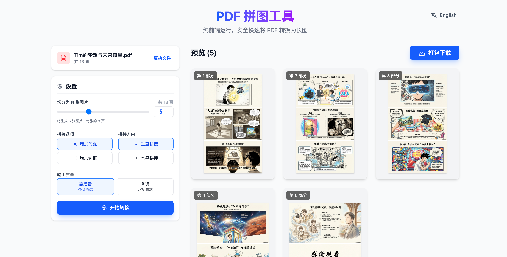
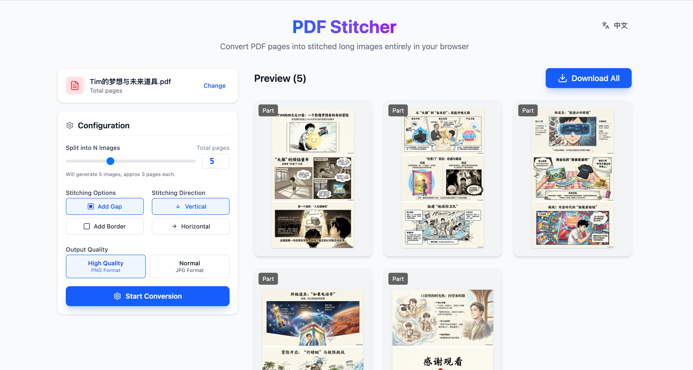

# PDF Stitcher / PDF 拼图工具

**Pure Frontend PDF to Long Image Converter**
**纯前端 PDF 转长图工具**

## 🇨🇳 中文介绍

无需上传文件到服务器，完全在浏览器本地运行，安全快速。

**核心功能：**
- 🖼️ **智能拼接**：自定义切分数量，支持垂直/水平拼接
- 🎨 **样式调整**：支持添加间距和边框
- ⚡ **即时预览**：所见即所得，支持点击查看大图
- 📦 **一键打包**：生成高清图片并打包下载

---

## 🇺🇸 English Introduction

Secure and fast PDF to long image converter running entirely in your browser. No server upload required.

**Key Features:**
- 🖼️ **Smart Stitching**: Custom split count, vertical/horizontal stitching
- 🎨 **Style Options**: Adjustable gaps and borders
- ⚡ **Instant Preview**: Real-time preview with zoom capability
- 📦 **Batch Export**: Generate high-quality images and download as ZIP

